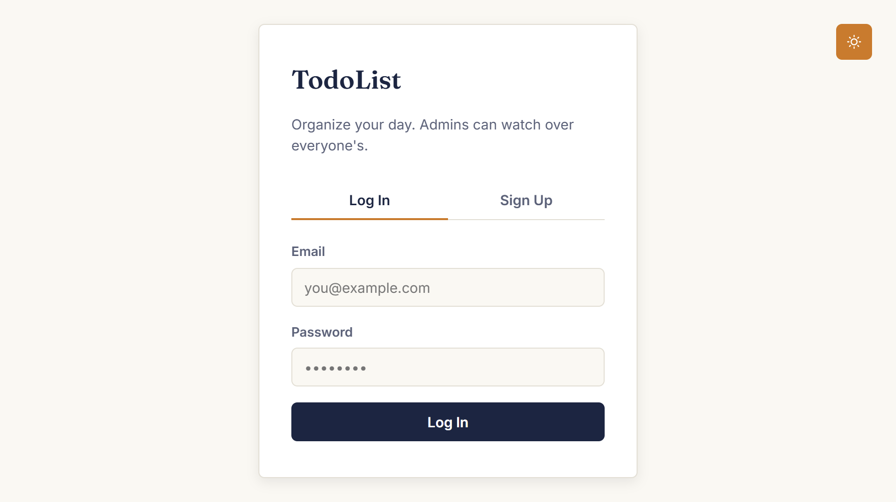
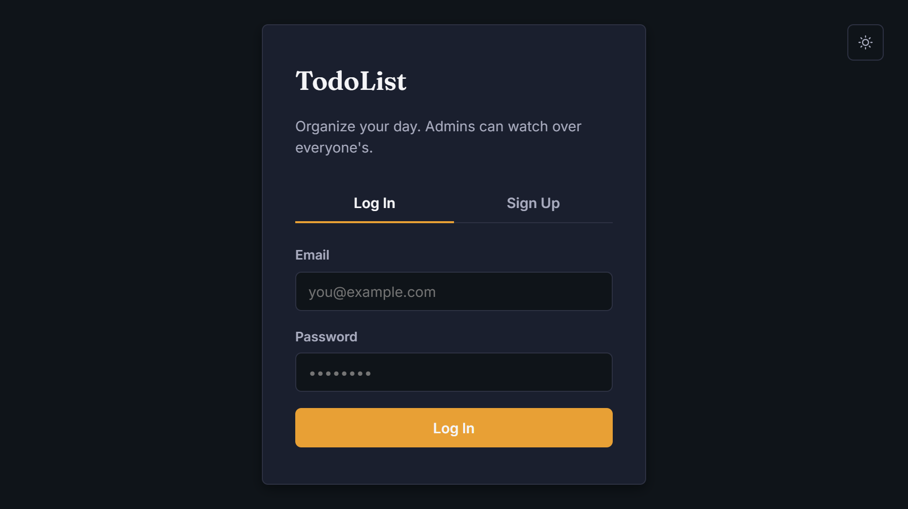
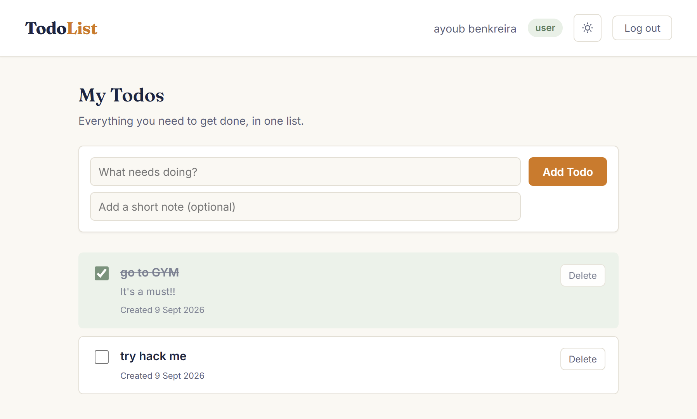
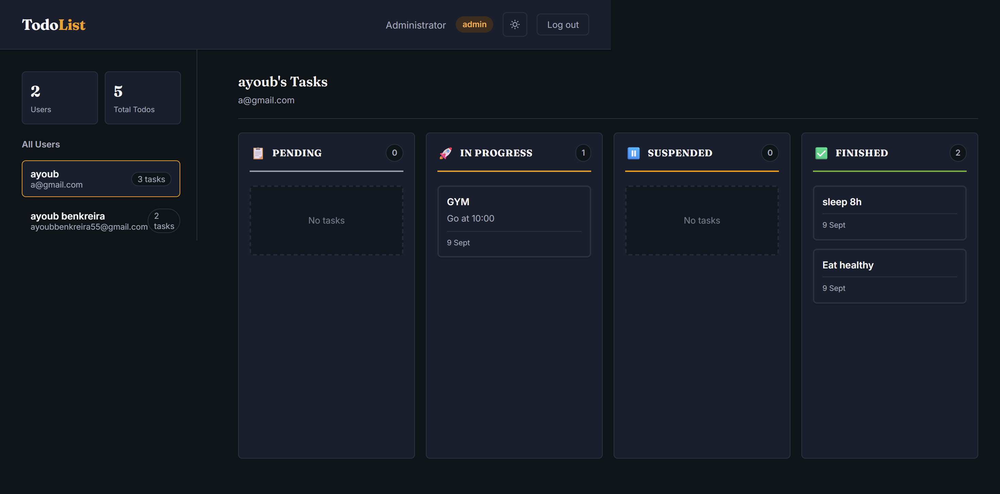

# 📝 TodoList - Modern Full-Stack Task Management Application

<div align="center">


A feature-rich, enterprise-ready todo application with role-based access control, beautiful UI/UX, and smooth animations.

[Features](#-features) • [Demo](#-demo) • [Quick Start](#-quick-start) • [Tech Stack](#-tech-stack) • [Documentation](#-documentation)

</div>

---

## ✨ Features

### 📊 **Kanban Board System**
- **4-Column Layout** - Pending, In Progress, Suspended, Finished
- **Drag-and-Drop Interface** - Intuitive HTML5 drag-and-drop API
- **Real-Time Status Updates** - Changes sync instantly to database
- **Visual Feedback** - Column highlighting, card animations, task counts
- **Flexible Workflow** - Move tasks freely between any columns
- **Color-Coded Statuses** - Each column has its own distinct theme

### 🎨 **Beautiful Modern UI**
- **Dark Mode Support** - Seamless theme switching with persistent preference
- **Smooth Animations** - Professional fade-in, slide, scale, and bounce effects
- **Responsive Design** - Works perfectly on desktop, tablet, and mobile
- **Clean Interface** - Minimalist design with thoughtful typography (Fraunces & Inter fonts)
- **Interactive Transitions** - Hover effects, drag animations, and visual feedback

### 🔐 **Security & Authentication**
- **JWT-Based Authentication** - Secure token-based session management
- **Password Hashing** - Bcrypt encryption for all passwords
- **Role-Based Access Control** - Separate user and admin permissions
- **Protected Routes** - Backend validation for all sensitive operations

### 👥 **Role Management**
- **User Dashboard** - Personal task management with Kanban board
- **Admin Dashboard** - Complete oversight of all users and their tasks in Kanban view
- **Real-Time Stats** - User count and task metrics
- **User Browse** - Click any user to view their complete Kanban board

### ⚡ **Core Functionality**
- Create, Read, Update, Delete tasks
- Drag tasks between status columns
- Add optional descriptions to tasks
- Timestamps for all tasks
- Instant UI updates with optimistic rendering
- Error handling with user-friendly messages

### 🎯 **Developer Experience**
- Clean, modular codebase
- RESTful API architecture
- MVC pattern implementation
- No build step required for frontend
- Well-documented code
- Easy to extend and customize

---

## 🚀 Demo

### Login Page
<p align="center">
  
  <br/>
  <em>Clean, modern login interface with tab navigation</em>
</p>

<p align="center">
  
  <br/>
  <em>Beautiful dark mode with optimized color palette</em>
</p>

### User Dashboard
<p align="center">
  
  <br/>
  <em>Kanban board with drag-and-drop task management</em>
</p>

- **Drag and drop** tasks between 4 status columns
- Add new tasks with optional descriptions
- Visual column indicators and task counts
- Delete tasks directly from cards
- Smooth animations on every interaction

### Admin Dashboard
<p align="center">
  
  <br/>
  <em>Comprehensive user oversight with Kanban view</em>
</p>

- View all registered users
- Browse individual user task boards in Kanban format
- Real-time statistics (user count, total tasks)
- Clean, organized interface with status breakdown

---

## 🛠 Tech Stack

### Frontend
- **HTML5** - Semantic markup
- **CSS3** - Custom properties, animations, flexbox
- **Vanilla JavaScript** - No frameworks, pure ES6+
- **Font Awesome** - Icon system
- **Google Fonts** - Fraunces & Inter typography

### Backend
- **Node.js** - Runtime environment
- **Express.js** - Web framework
- **MySQL** - Relational database
- **JWT** - Authentication tokens
- **Bcrypt** - Password hashing
- **CORS** - Cross-origin resource sharing

### Development
- **Nodemon** - Auto-restart development server
- **dotenv** - Environment variable management
- **ESLint Ready** - Code quality tools compatible

---

## 📦 Quick Start

### Prerequisites

Ensure you have these installed:
- [Node.js](https://nodejs.org/) (v18 or higher)
- [MySQL](https://dev.mysql.com/downloads/) (v8 recommended)
- [Git](https://git-scm.com/)

### Installation

1. **Clone the repository**
```bash
git clone https://github.com/yourusername/todo-app.git
cd todo-app
```

2. **Set up the database**
```bash
mysql -u root -p < backend/schema.sql
```

> **Note:** If you're updating from an older version without Kanban support, run the migration:
> ```bash
> mysql -u root -p < backend/migrate-to-kanban.sql
> ```

3. **Configure environment variables**
```bash
cd backend
cp .env.example .env
# Edit .env with your MySQL credentials
```

4. **Install dependencies**
```bash
npm install
```

5. **Start the backend server**
```bash
npm start
```

6. **Open the frontend**
   - Option 1: Use VS Code Live Server extension
   - Option 2: Open `frontend/index.html` in your browser
   - Option 3: Use Python's HTTP server:
     ```bash
     cd frontend
     python3 -m http.server 5500
     ```

7. **Login with default admin account**
   - Email: `admin@todo.com`
   - Password: `Admin123!`

---

## 📚 Documentation

### Project Structure
```
todo-app/
├── backend/
│   ├── config/
│   │   └── db.js                 # MySQL connection
│   ├── controllers/
│   │   ├── authController.js     # Login/Register logic
│   │   ├── todoController.js     # Todo CRUD operations
│   │   └── adminController.js    # Admin operations
│   ├── middleware/
│   │   └── auth.js               # JWT verification
│   ├── routes/
│   │   ├── authRoutes.js         # Auth endpoints
│   │   ├── todoRoutes.js         # Todo endpoints
│   │   └── adminRoutes.js        # Admin endpoints
│   ├── .env.example              # Environment template
│   ├── schema.sql                # Database schema
│   ├── package.json
│   └── server.js                 # App entry point
│
├── frontend/
│   ├── css/
│   │   └── style.css             # All styles + animations
│   ├── js/
│   │   ├── api.js                # API communication
│   │   ├── auth.js               # Login/Register page
│   │   ├── user.js               # User dashboard
│   │   └── admin.js              # Admin dashboard
│   ├── index.html                # Login/Register page
│   ├── user.html                 # User dashboard
│   └── admin.html                # Admin dashboard
│
└── README.md
```

### API Endpoints

#### Authentication (Public)
```http
POST /api/auth/register
POST /api/auth/login
```

#### Todos (Authenticated)
```http
GET    /api/todos                # Get my todos
POST   /api/todos                # Create todo
PUT    /api/todos/:id            # Update todo title/description
PATCH  /api/todos/:id/status     # Update status (drag-and-drop)
PATCH  /api/todos/:id/toggle     # Toggle completion (legacy)
DELETE /api/todos/:id            # Delete todo
```

**Status values**: `pending`, `in_progress`, `suspended`, `finished`

#### Admin (Admin Only)
```http
GET    /api/admin/users            # List all users
GET    /api/admin/users/:id/todos  # View user's todos
DELETE /api/admin/users/:id        # Delete user
GET    /api/admin/todos            # View all todos
```

### Environment Variables

```env
# Database Configuration
DB_HOST=localhost
DB_PORT=3306
DB_USER=root
DB_PASSWORD=your_password
DB_NAME=todo_app

# Server Configuration
PORT=5000

# Security
JWT_SECRET=your_long_random_secret_key_here
```

---

## 🎨 Key Features Explained

### Kanban Board System
- **HTML5 Drag-and-Drop API** - Native browser drag-and-drop with visual feedback
- **4 Status Columns** - Pending → In Progress → Suspended → Finished
- **Optimistic UI Updates** - Instant visual feedback before server confirmation
- **Real-time Database Sync** - Status changes persist immediately to MySQL
- **Flexible Workflow** - Move tasks between any columns without restrictions
- **Color-Coded Columns** - Each status has its own distinct visual theme

### Dark Mode Implementation
- CSS custom properties for theme colors
- JavaScript toggle with localStorage persistence
- System preference detection
- Smooth color transitions (0.3s ease)

### Animation System
- Keyframe animations: fadeIn, slideInLeft, slideInRight, scaleIn, pulse, bounce
- Staggered delays for sequential animations
- Hover effects with transform and shadow
- Drag-and-drop animations with visual feedback
- Active states for user feedback

### Security Measures
- Password hashing with bcrypt (10 salt rounds)
- JWT tokens with expiration
- Role-based middleware protection
- SQL injection prevention via parameterized queries
- CORS configuration

---

## 🔒 Security Best Practices

✅ **Implemented in this project:**
- Passwords hashed before storage
- JWT tokens for stateless authentication
- Backend role validation
- Protected API routes
- Environment variables for secrets
- Parameterized SQL queries

⚠️ **For production deployment, also add:**
- HTTPS/SSL certificates
- Rate limiting
- Input sanitization
- CSRF protection
- Security headers (helmet.js)
- Password strength requirements
- Email verification

---

## 🌟 Highlights for Recruiters

### Code Quality
- ✅ Clean, modular architecture
- ✅ Consistent naming conventions
- ✅ Comprehensive error handling
- ✅ Well-commented code
- ✅ RESTful API design
- ✅ MVC pattern implementation

### Technical Skills Demonstrated
- **Backend Development**: Node.js, Express, RESTful APIs
- **Database Management**: MySQL, schema design, relationships
- **Authentication**: JWT, Bcrypt, session management
- **Frontend Development**: Responsive design, animations, JavaScript
- **Security**: Role-based access, password hashing, token validation
- **UX/UI**: Dark mode, smooth animations, intuitive design

### Professional Practices
- Environment configuration
- Secure credential management
- Git version control ready
- Documentation
- Error handling
- User feedback (loading states, error messages)

---

## 🚀 Future Enhancements

Potential features to extend this project:

- [x] **Kanban Board** - Drag-and-drop task management ✅ IMPLEMENTED
- [x] **4 Status Columns** - Pending, In Progress, Suspended, Finished ✅ IMPLEMENTED
- [ ] Due dates and priorities
- [ ] Categories/tags for tasks
- [ ] Search and filter functionality
- [ ] Email notifications
- [ ] Task sharing between users
- [ ] Subtasks and checklists
- [ ] Export to PDF/CSV
- [ ] Two-factor authentication
- [ ] Password reset flow
- [ ] Real-time collaboration (Socket.io)
- [ ] Mobile app (React Native)
- [ ] Task comments and attachments
- [ ] Activity history and audit logs

---

## 📝 License

This project is open source and available under the [MIT License](LICENSE).

---

## 👤 Author

**Ayoub**

- Portfolio: [your-portfolio.com](#)
- LinkedIn: [linkedin.com/in/yourprofile](#)
- GitHub: [@yourusername](https://github.com/yourusername)

---

## 🙏 Acknowledgments

- Design inspiration from modern task management applications
- Font families: Fraunces (Google Fonts), Inter (Google Fonts)
- Icons: Custom SVG icons

---

<div align="center">

### ⭐ Star this repository if you found it helpful!

**Built with ❤️ by Ayoub**

</div>
